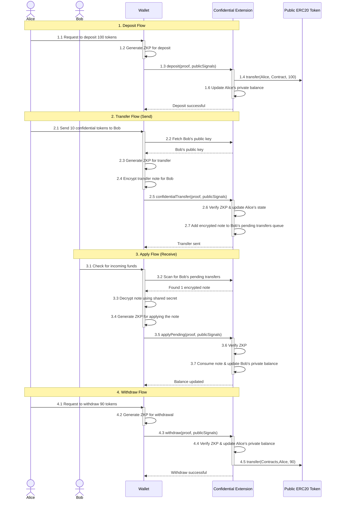
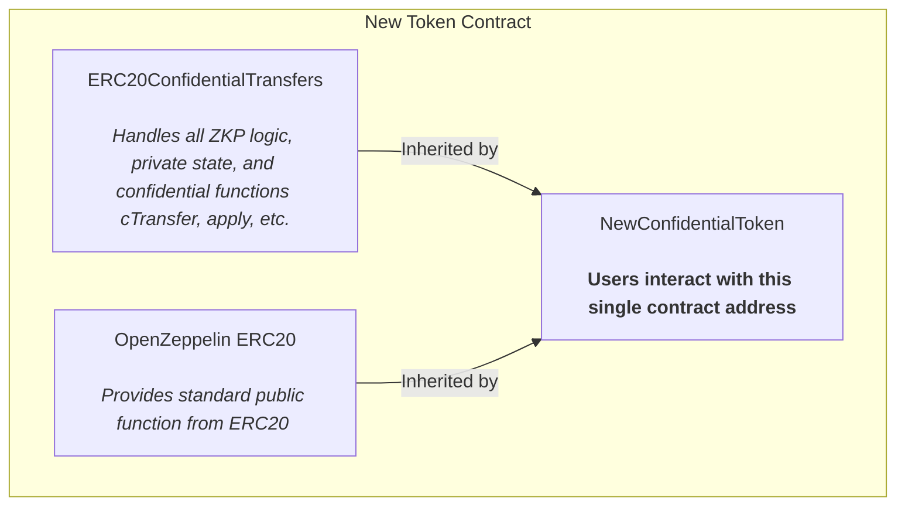
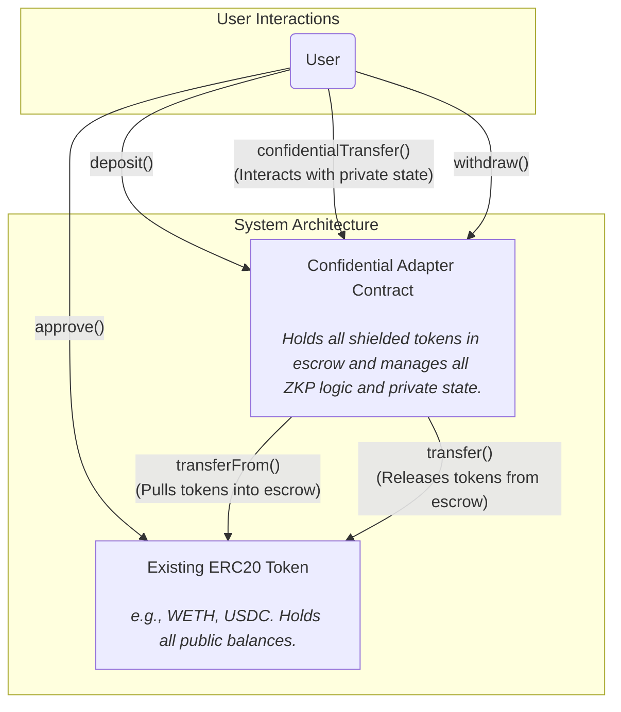
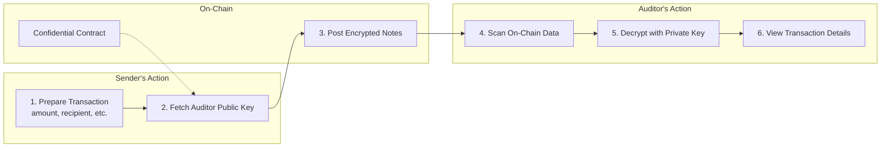
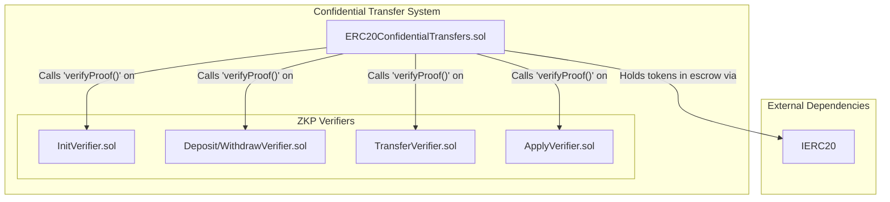
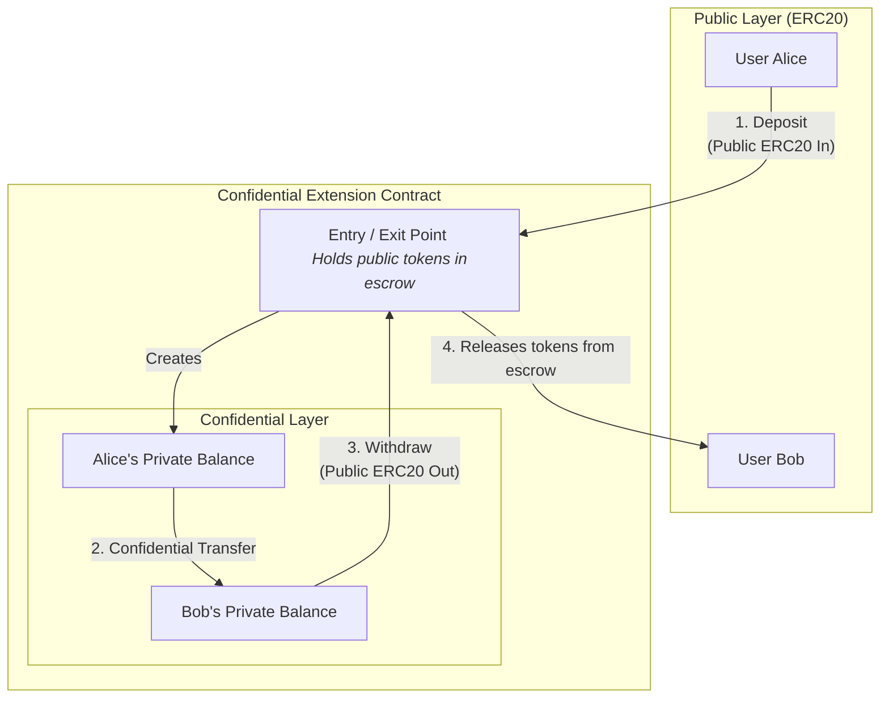

## Architectural Diagrams

### Integration Pattern 1: Inheritance

This pattern involves creating a new token contract that inherits from both a standard ERC20 implementation (like OpenZeppelin's) and our `ERC20ConfidentialTransfers` contract.

**Pros:** All functionality is bundled into a single, unified contract address.

**Cons:** Requires deploying a brand new token; cannot be used to add confidentiality to an _existing_ ERC20 token.

### Integration Pattern 2: Adapter (Wrapper)

> If existing token deployed with Proxy pattern, it can be upgraded to use the Confidential Extension without adapter.

This pattern uses a separate "Adapter" or "Extension" contract that "wraps" an existing, already-deployed ERC20 token. Users interact with the Adapter to access confidential features.

**Pros:** Can add confidential functionality to _any_ existing ERC20 token without needing to migrate liquidity or deploy a new token.

**Cons:** Users need to know two contract addresses (the token and the adapter). The adapter needs to hold the tokens in escrow.

### Auditor Visibility Flow

This diagram shows the flow of information that ensures auditor visibility for every transaction.

### Contract Architecture Diagram

This diagram shows the composition of the confidential transfer system at the smart contract level. It illustrates how a central logic contract (`ERC20ConfidentialTransfers`) orchestrates multiple, single-purpose ZKP verifier contracts.

### Core Concept: The Shielded Pool

This diagram illustrates the main architectural concept. The contract acts as a "shielded pool" that holds public ERC20 tokens in escrow, allowing users to transact with a private representation of those tokens on a "ZK Layer".

